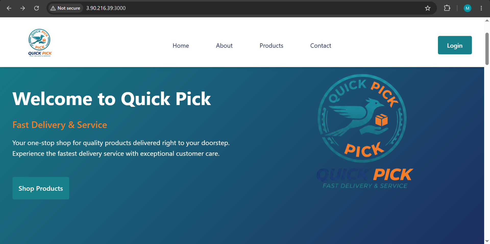

# Quick Pick — AWS Deployment

> Production-ready deployment of the **Quick Pick MERN E-Commerce Platform** using **Docker**, **GitHub Actions**, and **AWS EC2**.

---

<p align="center">
  
</p>

> **Quick Pick running successfully on AWS after automated CI/CD deployment.**

---

# Table of Contents

- Overview
- Application Summary
- Deployment Overview
- Deployment Architecture
- Technology Stack
- Project Structure
- CI/CD Pipeline
- Docker Setup
- AWS Infrastructure
- GitHub Actions Workflow
- Deployment Steps
- Running Locally
- Lessons Learned
- Future Improvements

---

# Overview

This repository demonstrates how the **Quick Pick MERN E-Commerce Platform** is deployed to AWS using modern DevOps practices.

Instead of manually building and deploying the application after every update, the project uses an automated CI/CD pipeline powered by GitHub Actions. Every push to the `main` branch automatically builds Docker images, connects to the AWS EC2 instance, and deploys the latest version of the application.

The goal of this repository is to showcase production deployment skills including:

- Docker containerization
- CI/CD automation
- AWS EC2 deployment
- Production-ready environment configuration
- Secure deployment workflow

---

# Application Summary

Quick Pick is a production-ready MERN stack e-commerce platform built to digitize a local business's ordering process.

Core features include:

- Secure JWT Authentication
- Product Browsing
- Product Search & Filters
- Shopping Cart
- Checkout System
- Order Management
- Email Notifications
- Responsive UI
- Production Deployment

Although this repository focuses on deployment, the deployed application demonstrates a complete full-stack workflow from authentication to order processing.

---

# Deployment Overview

The deployment pipeline automates the complete release process.

Whenever new code is pushed to GitHub:

1. GitHub Actions is triggered.
2. Docker images are built.
3. Images are transferred to the AWS EC2 server.
4. Docker Compose recreates the application containers.
5. The latest version becomes available automatically.

This removes the need for manual deployment while ensuring consistency across environments.

---

# Deployment Architecture

```
Developer
      │
      ▼
GitHub Repository
      │
      ▼
GitHub Actions
      │
      ▼
Docker Build
      │
      ▼
AWS EC2
      │
      ▼
Docker Compose
      │
      ▼
Frontend + Backend Containers
      │
      ▼
Live Application
```

---

# Technology Stack

## Frontend

- React
- Vite
- React Router
- Axios

## Backend

- Node.js
- Express.js
- MongoDB
- JWT Authentication

## DevOps

- Docker
- Docker Compose
- GitHub Actions
- AWS EC2
- Git

---

# Project Structure

```
QuickPick/
│
├── Backend/
│   ├── controllers/
│   ├── middleware/
│   ├── models/
│   ├── routes/
│   ├── Dockerfile
│   └── server.js
│
├── Frontend/
│   ├── src/
│   ├── public/
│   ├── Dockerfile
│   └── vite.config.js
│
├── docker-compose.yml
│
├── .github/
│   └── workflows/
│       └── deploy.yml
│
├── assets/
│   └── deployment-preview.png
│
└── README.md
```

---

# CI/CD Pipeline

The project uses GitHub Actions to automate deployments.

Pipeline workflow:

```
Push to Main
      │
      ▼
GitHub Actions Trigger
      │
      ▼
Checkout Repository
      │
      ▼
Build Docker Images
      │
      ▼
Connect to AWS EC2
      │
      ▼
Pull Latest Changes
      │
      ▼
Docker Compose Build
      │
      ▼
Restart Containers
      │
      ▼
Deployment Complete
```

Benefits:

- Zero manual deployment
- Faster releases
- Consistent environments
- Reduced deployment errors
- Repeatable production workflow

---

# Docker Setup

The application is fully containerized.

Separate Dockerfiles are used for:

- Frontend
- Backend

Docker Compose manages both services together, making local development and production deployment consistent.

Key benefits include:

- Environment consistency
- Simplified deployment
- Easy scalability
- Dependency isolation

---

# AWS Infrastructure

Deployment target:

- AWS EC2 Instance

The EC2 server hosts:

- Frontend container
- Backend container
- Docker Engine
- Docker Compose

The server pulls the latest code and recreates containers whenever the deployment workflow executes.

---

# GitHub Actions Workflow

The deployment workflow automates:

- Repository checkout
- Docker image build
- Secure SSH connection
- Code synchronization
- Container recreation
- Application restart

Every deployment follows the same repeatable process, ensuring reliability across releases.

---

# Deployment Steps

## Clone Repository

```bash
git clone <repository-url>
```

---

## Configure Environment Variables

Backend

```env
MONGO_URI=
JWT_SECRET=
EMAIL_USER=
EMAIL_PASS=
SENDGRID_API_KEY=
```

Frontend

```env
VITE_API_URL=
```

---

## Build Containers

```bash
docker compose build
```

---

## Run Containers

```bash
docker compose up -d
```

---

## Verify Running Containers

```bash
docker ps
```

---

# Running Locally

Clone the repository

```bash
git clone <repository-url>
```

Build

```bash
docker compose build
```

Run

```bash
docker compose up
```

Visit

```
http://localhost
```

---

# Lessons Learned

This deployment project provided practical experience with:

- Docker containerization
- Docker Compose
- CI/CD automation
- GitHub Actions
- AWS EC2 deployment
- Production environment variables
- Secure deployment workflows
- Container orchestration
- Production debugging

Most importantly, it demonstrated how modern DevOps practices can automate software delivery while maintaining consistency between development and production environments.

---

# Future Improvements

Possible enhancements include:

- Nginx Reverse Proxy
- SSL with Let's Encrypt
- Custom Domain
- Monitoring with Prometheus & Grafana
- Centralized Logging
- Auto Scaling
- Load Balancer
- Blue-Green Deployment
- Kubernetes Migration

---

# Author

**Muhammad Zeeshan**

Full Stack Developer | MERN Stack | DevOps Enthusiast

---

> This repository focuses on the deployment of the Quick Pick application using Docker, GitHub Actions, and AWS EC2, demonstrating a complete production-ready CI/CD workflow.